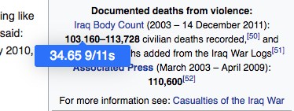

# hfsday

A Chrome extension that shows highlighted numbers in terms of 9/11 casualties (not including the hijackers, because fuck those guys). Useful for reading about American adventurism done in its name.

## Usage

Just highlight the number you wish to evaluate and press the extension button on your toolbar. This will display a tooltip with the number shown in terms of "9/11s".

Doing this to additional selections of numbers on the web page will keep the tooltips intact, and the figures will be available for reference any time you hover over those numbers until you refresh the page.

## Credits

* [Drooltip](https://prevwong.github.io/drooltip.js/) is a damn fine simple tooltip library.
* hfsday is named after The Onion's edition title in reaction to September 11th which was, appropriately "Holy Fucking Shit: Attack On America".
